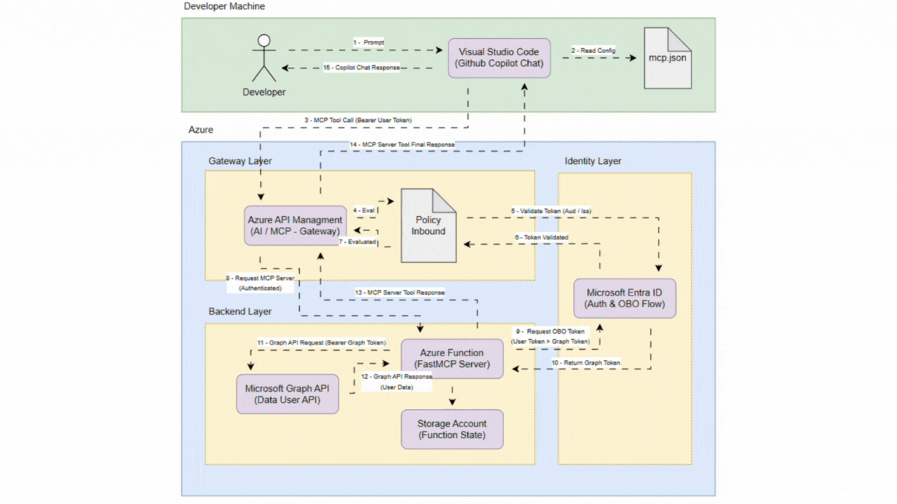

**Lab APIM MCP**

- **Overview**: A small repository for APIM MCP integrations and functions.

**Demo**

Below is a short demo animation illustrating the main function in this repository.

**Usage**

- **View demo**: Open `README.md` in a Markdown viewer or on GitHub to see the embedded GIF.
- **Files**: The demo GIF is at `./mcp-apim-entraid-obo-function.gif`.

**Notes**

- **Edit**: Update this README with additional details about the project, setup, and usage as needed.
